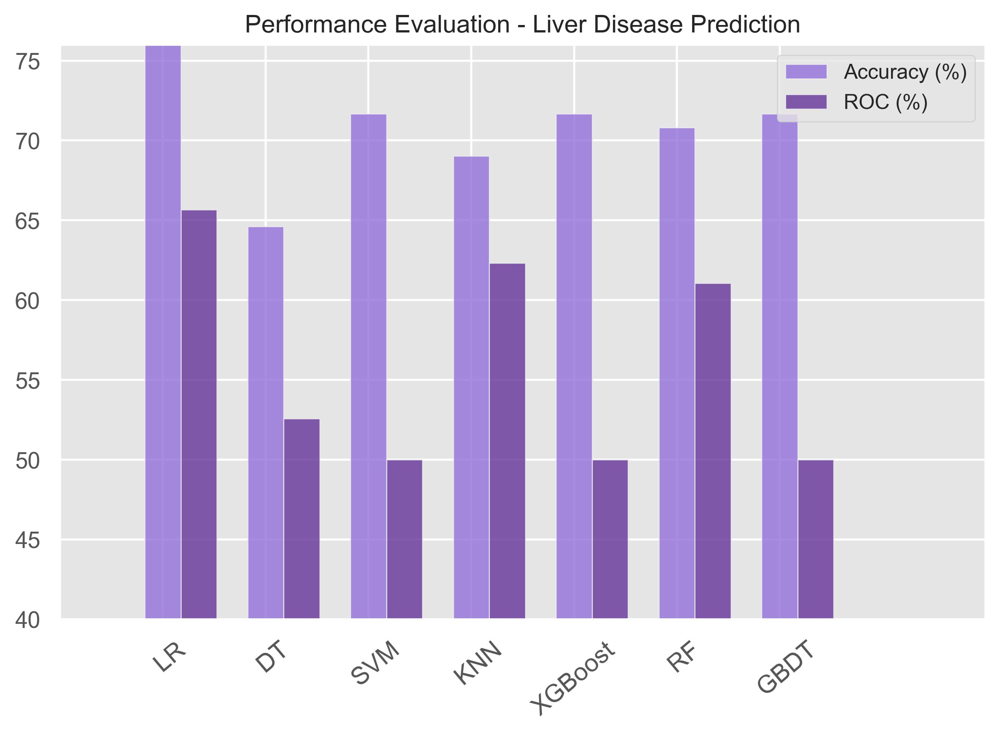
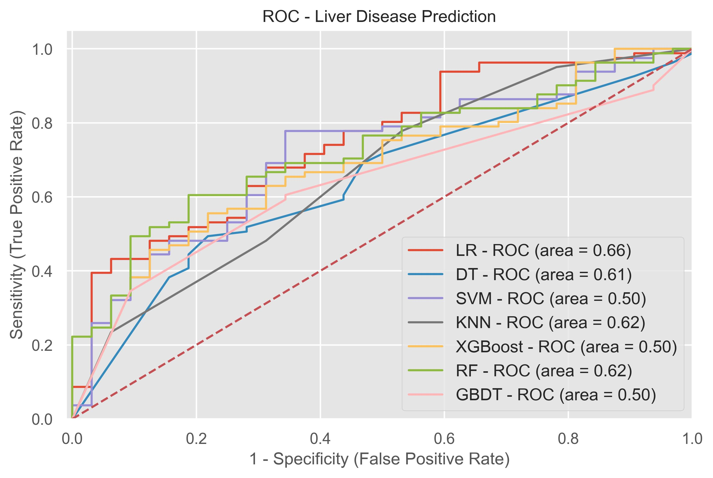

## 🦺 Liver Disease Prediction - Performance Evaluation

### 📄 Overview

This project focuses on evaluating multiple machine learning models for predicting liver disease. The dataset includes various patient health parameters, and the models' performances are compared using Accuracy and ROC-AUC metrics.

### 📊 Models Evaluated:
- Logistic Regression (LR)
- Decision Tree (DT)
- Support Vector Machine (SVM)
- K-Nearest Neighbors (KNN)
- XGBoost
- Random Forest (RF)
- Gradient Boosted Decision Trees (GBDT)

---

## 📈 Performance Metrics

### 🔹 Accuracy and ROC Score Comparison:

| Model        | Accuracy (%) | ROC-AUC (%) |
|-------------|-------------|------------|
| Logistic Regression (LR) | ~76          | 66         |
| Decision Tree (DT)       | ~65          | 61         |
| SVM                      | ~72          | 50         |
| KNN                      | ~69          | 62         |
| XGBoost                  | ~72          | 50         |
| Random Forest (RF)       | ~71          | 62         |
| GBDT                     | ~71          | 50         |

---

### 🔹 ROC Curve Analysis:

| Model        | ROC-AUC Score |
|-------------|--------------|
| Logistic Regression (LR) | 0.66 |
| Decision Tree (DT)       | 0.61 |
| SVM                      | 0.50 |
| KNN                      | 0.62 |
| XGBoost                  | 0.50 |
| Random Forest (RF)       | 0.62 |
| GBDT                     | 0.50 |

---

## 🔥 Key Observations:

- **Logistic Regression (LR)** consistently outperforms others in both **Accuracy (~76%)** and **ROC-AUC (0.66)**.
- **Random Forest (RF)** and **KNN** models show competitive results with good balance between accuracy and ROC-AUC.
- **SVM, XGBoost, GBDT** models currently underperform (ROC-AUC ~0.50), indicating potential areas for hyperparameter tuning or feature engineering.
- Decision Tree shows moderate results but can overfit without pruning or tuning.

---

## 🚀 Future Improvements:

1. **Hyperparameter Tuning:**
   - GridSearchCV or RandomizedSearchCV for models like SVM, GBDT, and XGBoost.
2. **Feature Engineering:**
   - Explore interaction features, normalization, or removing irrelevant features.
3. **Ensemble Techniques:**
   - Combine multiple models using stacking or voting classifiers for improved performance.
4. **Handling Class Imbalance:**
   - Apply SMOTE or other resampling techniques if the dataset is imbalanced.
5. **Cross-Validation:**
   - Use k-fold cross-validation for a more generalized evaluation.

---

## 📁 Files Included:
| File | Description |
|------|-------------|
| `PE_liver.jpeg` | Bar graph comparing accuracy and ROC scores of models |
| `roc_liver.jpeg` | ROC curves with AUC values for all models |
| `README.md` | Project overview and evaluation summary (this file) |

---

## 🧐 Conclusion:
Logistic Regression proves to be the most reliable model for liver disease prediction based on the current dataset and metrics. Further experimentation and optimization might improve the results of other models.

